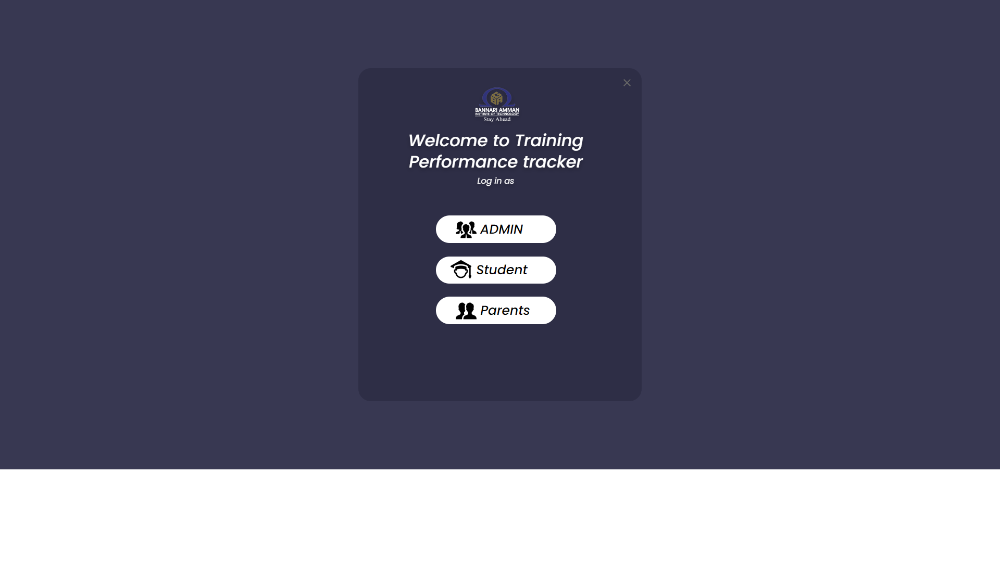
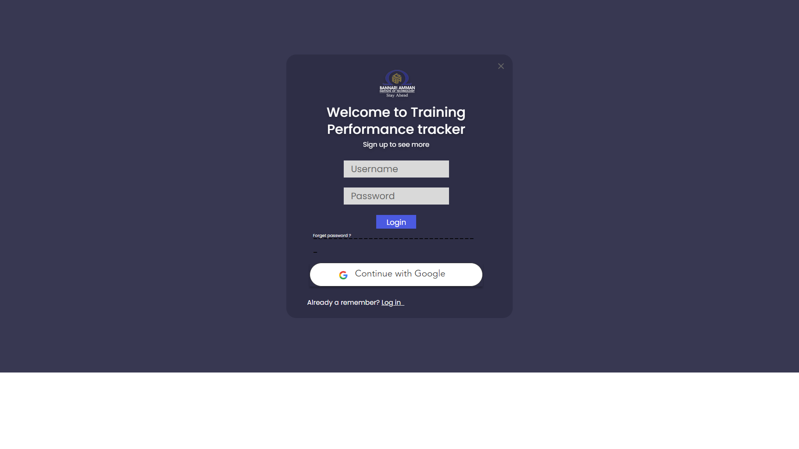
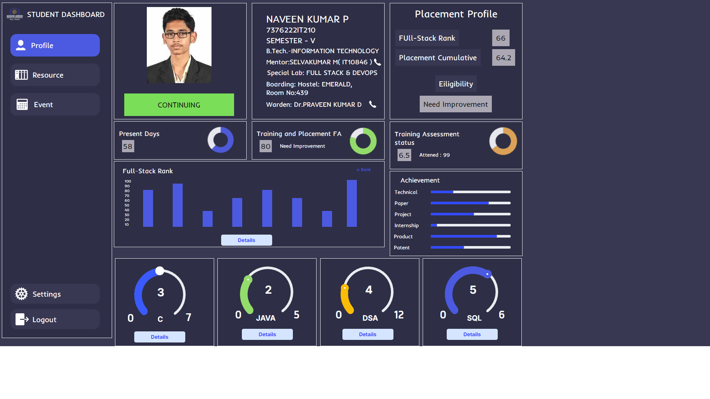

# Training Performance Tracker
Training Performance Tracker is a web-based application designed to help users track and monitor their training progress.

> [!NOTE]
> The project is still in active development, so there may be some bugs or incomplete features. Contributions and feedback are welcome!

> [!WARNING]
> Make sure you have [Nodejs](https://nodejs.org/en/download) installed before running the project.

## 🚀 Getting Started
To get a local copy of the project and run it on your device, follow the steps below:
### Clone the repository
```bash
git clone https://github.com/naveenkumar-42/Training_performance_tacker.git
cd Training_performance_tacker
```
### Install dependencies
```bash
npm install
```
### Run the project
```bash
npm start
```
The project should automatically open in your default web browser. If not, navigate to http://localhost:3000 in your browser to view the project.

## 🌐 Pages and Previews
The project includes the following pages:

### 🎉 Welcome Page

Welcome screen allows users to choose whether to log in as an **Admin**, **Student** or **Parent**.



### 🔐 Login Page

Users should log in to access their respective dashboard.



### 📊 Student Dashboard

After logging in, students will be directed to student dashboard where they can track their performance and progress.



### 🛠️ Admin Dashboard

Admins will be redirected to admin dashboard where they can manage student data and monitor performance statistics.


## 🐞 Issues and Feedback

The project is in active development, you may encounter issues or bugs. If so, please help us improve by submitting feedback via the [GitHub Issues page](https://github.com/naveenkumar-42/Training_performance_tacker/issues).

## 🛠 Contributing

Contributions are welcome! Feel free to submit pull requests to add features or resolve issues.

## 📧 Contact

For more information, reach out to the project maintainer on GitHub: [naveenkumar-42](https://github.com/naveenkumar-42)
